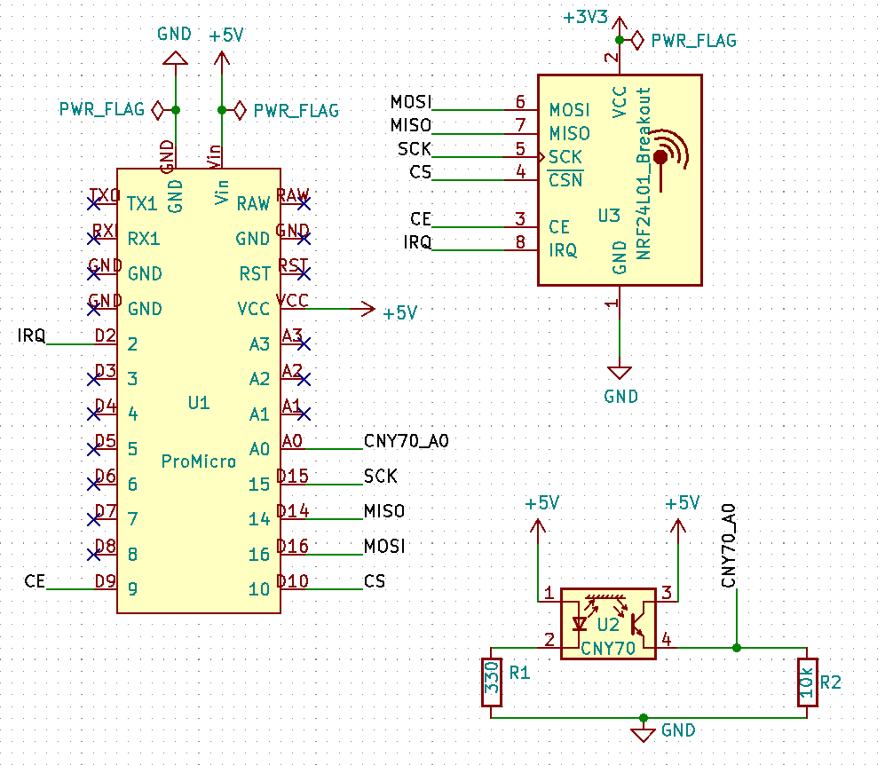
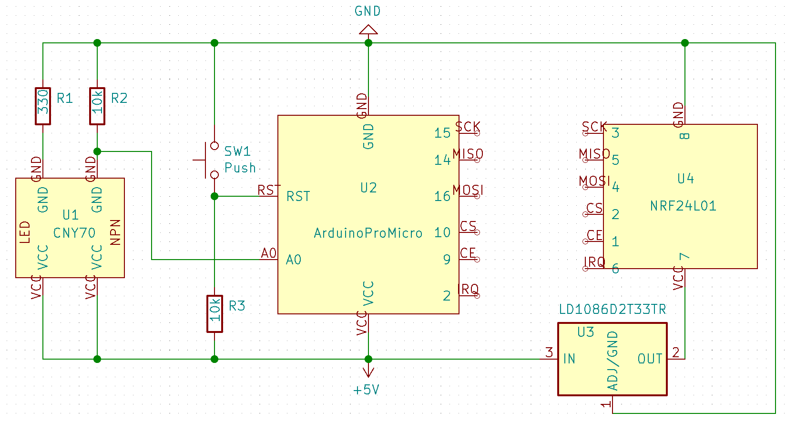

# windowsensor
An ongoing project. A microcontroller monitors the status (open/closed) of the windows and sends it to a Raspberry Pi. The Pi keeps statistics about everything and publishes the current status over MQTT.

### Components used:
- Arduino Pro Micro
- nRF24L01 module for every Arduino
- CNY70 distance sensor for every Arduino
- planned: some get a temperature sensor

### Code
The arduino code is written with the Arduino IDE and the Raspberry Pi uses Python scripts.

### Circuit design:

