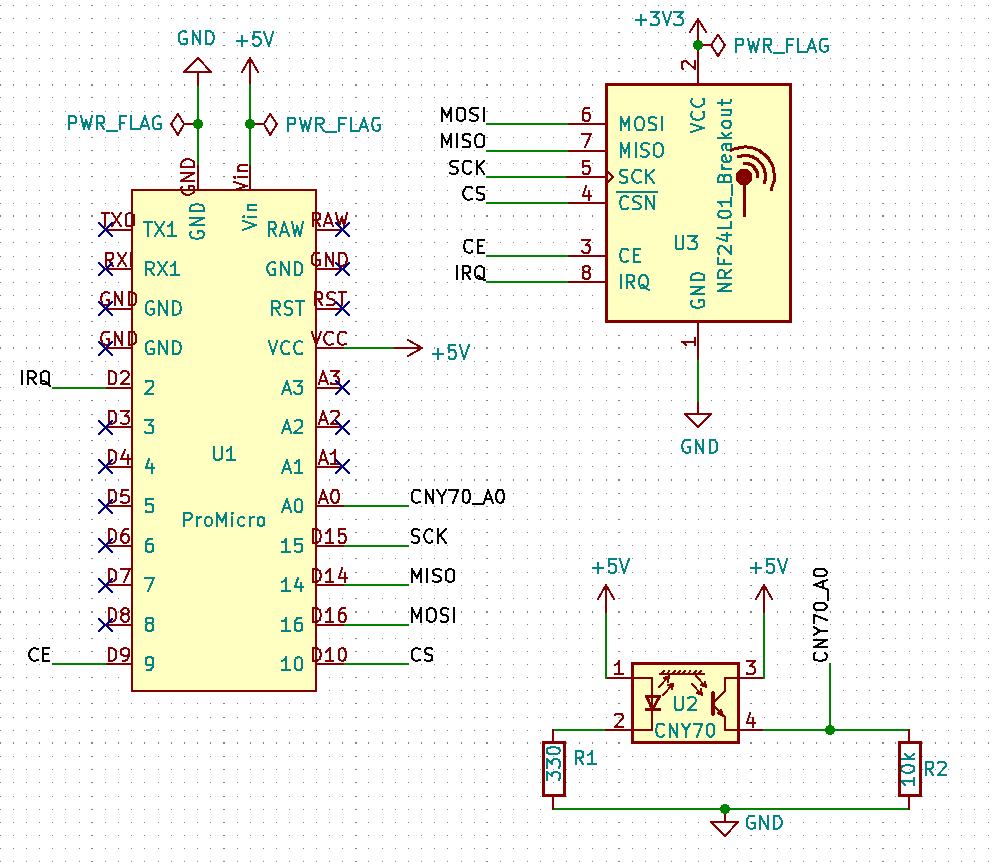
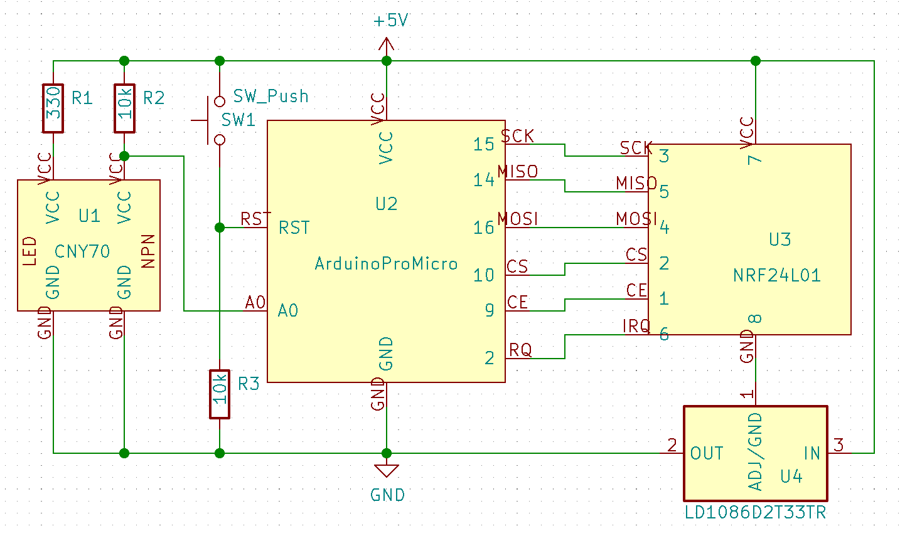

# windowsensor
An ongoing project...

## Idea
Sometimes I leave home and can't remember if I closed all windows if a thunderstorm comes along. With this project I want to monitor the status (open/closed) of all windows and publish it on a private site online. The setup should be power efficient and the sensors should work for a long time with just a coin cell.

## 1. Prototype
Every window gets an Arduino Pro Mini with an CNY70 distance sensor and a nRF24L01 module for data transmission. A Raspberry Pi wakes the Arduinos one at a time with a message, that induces an Interrupt on the Arduinos. The Arduino sends an acknowledgement, reads the sensor data and packs it into the next acknowledgement message. The Raspberry Pi sends a second message and receives the sensor data as ACK message. It writes the data into a file. The status gets published online through MQTT. At the moment on Adafruit IO. Every Arduino has a unique address.

#### Problem:
If the Arduinos need to wake up after an Interrupt came in, the nRF24 module can't go into sleep mode. This setup needs too much power.
#### Solution:
The Arduinos go into a deep sleep including the nRF24 module. They wake up after a certain amount of time and send their data to the Raspberry Pi. The Raspberry Pi code can run on a server that is running all the time anyway. The signal of two Arduinos could arrive at the same time, but rarely and with ACK messages that should be easy to handle. The message will be encrypted with AES.

### Components used:
- Arduino Pro Micro
- nRF24L01 module for every Arduino
- CNY70 distance sensor for every Arduino
- planned: a temperature sensor on some Arduinos

### Code
The arduino code is written with the Arduino IDE and the Raspberry Pi uses python scripts.

### Circuit design:

